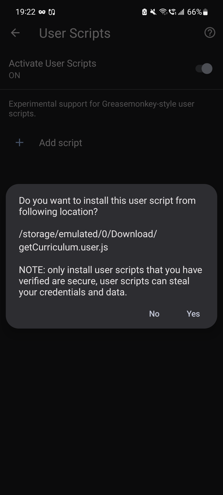
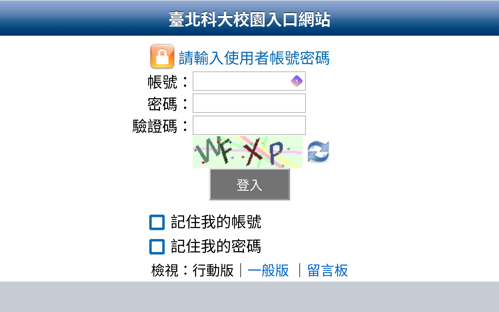
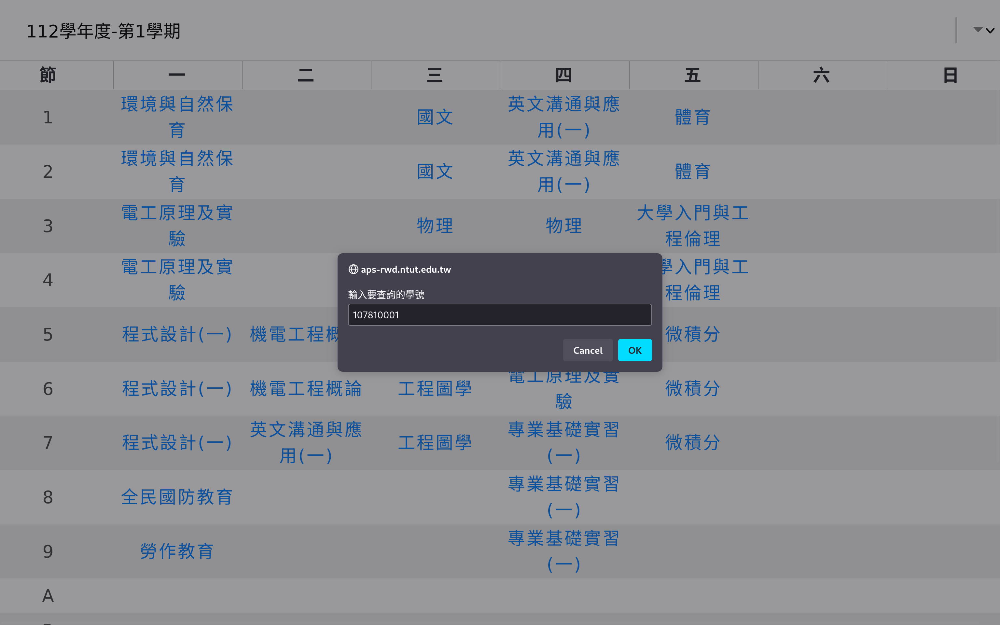

#  以學號取得北科大課表(其他行動裝置瀏覽器說明)
## 支援 Bromite/Cromite
[Download Cromite](https://github.com/uazo/cromite/releases)
## 安裝腳本
### 啟用 User Script

### 下載

### 點擊開啟

### 安裝

## 使用說明

### 登入校園入口

### 選擇左上角選單

### 選擇應用系統

### 選擇 App 應用程式

### 選擇課表查詢系統

### 輸入要查詢的學號

### 選擇學期

### 完成

