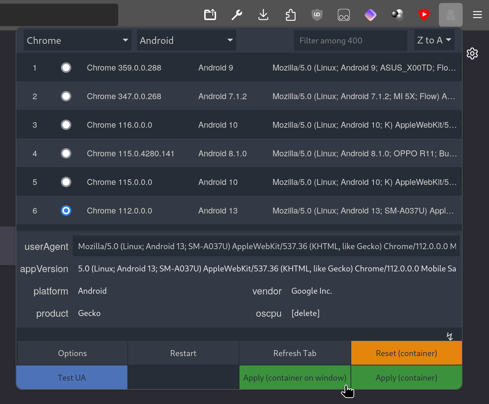
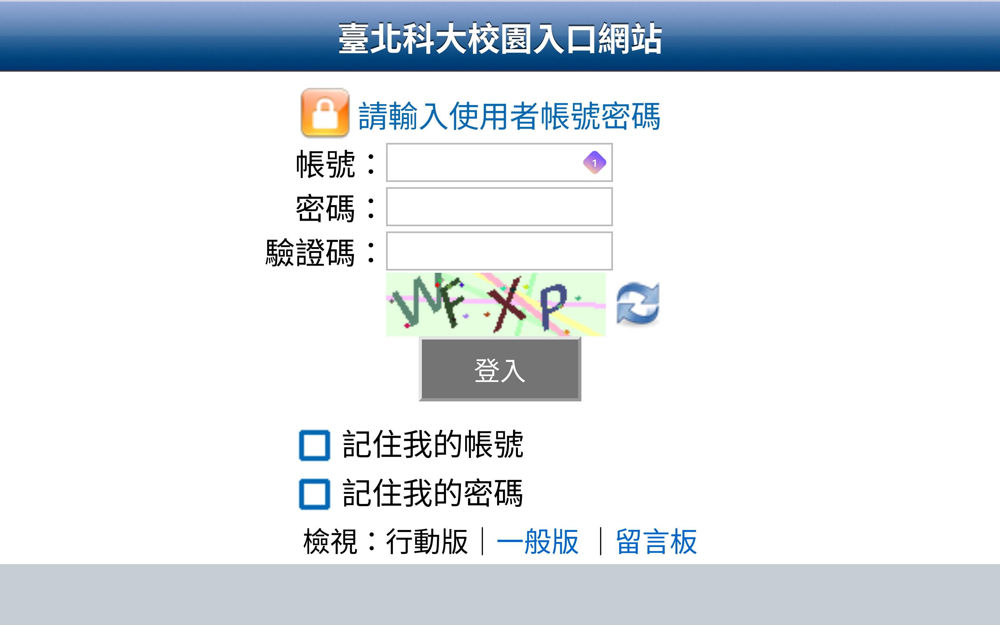
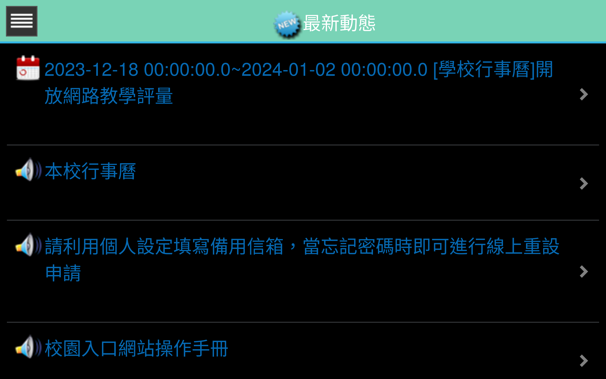
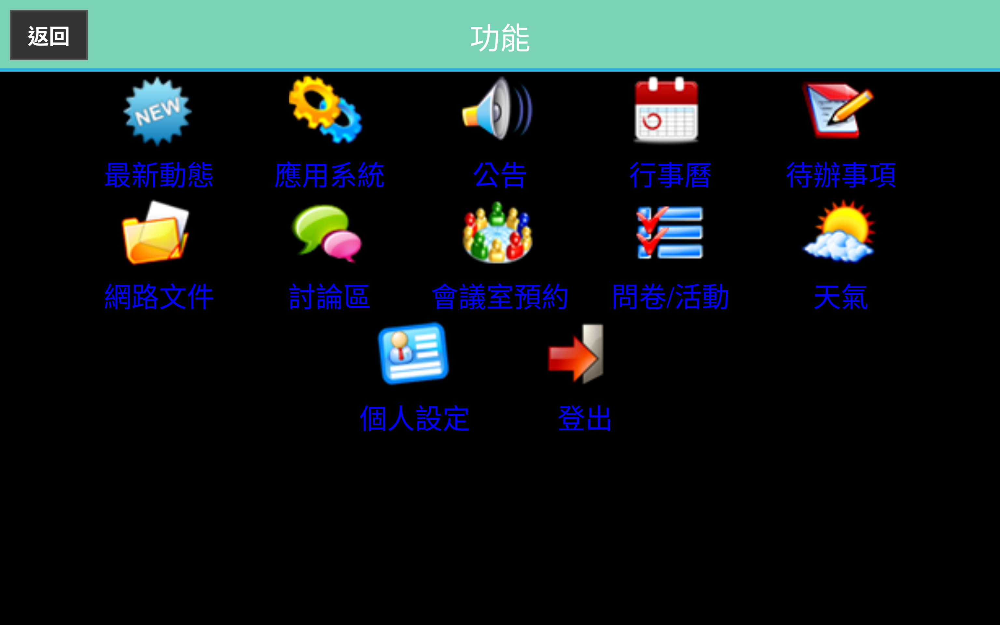
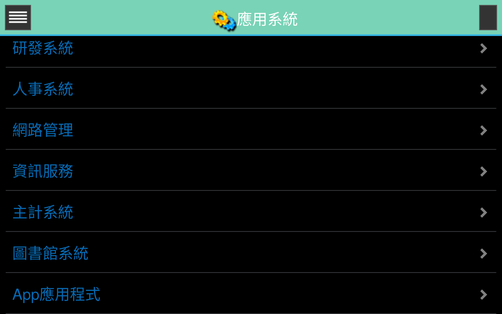
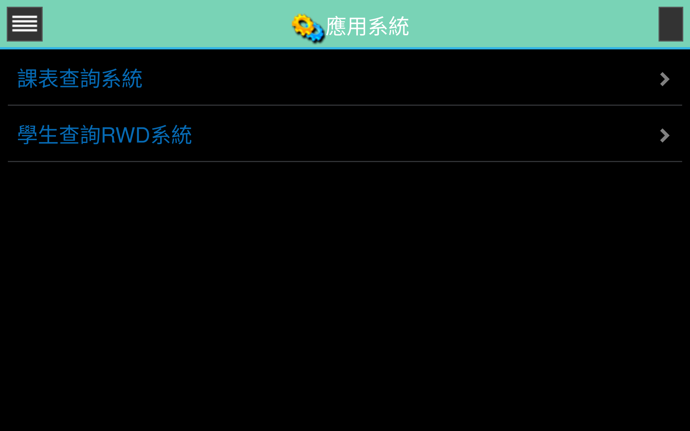
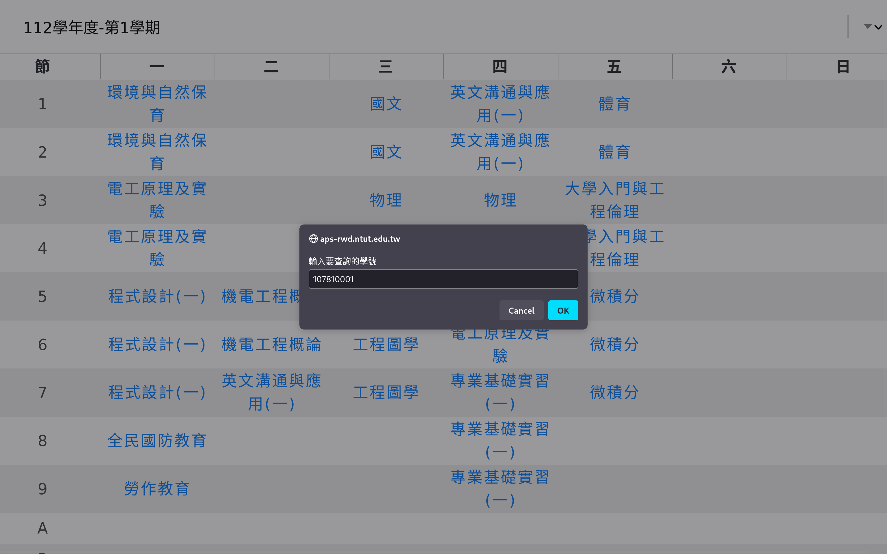
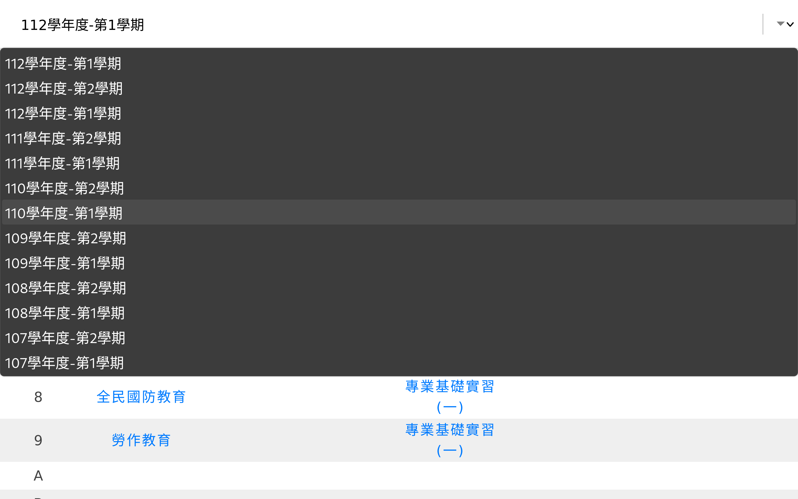
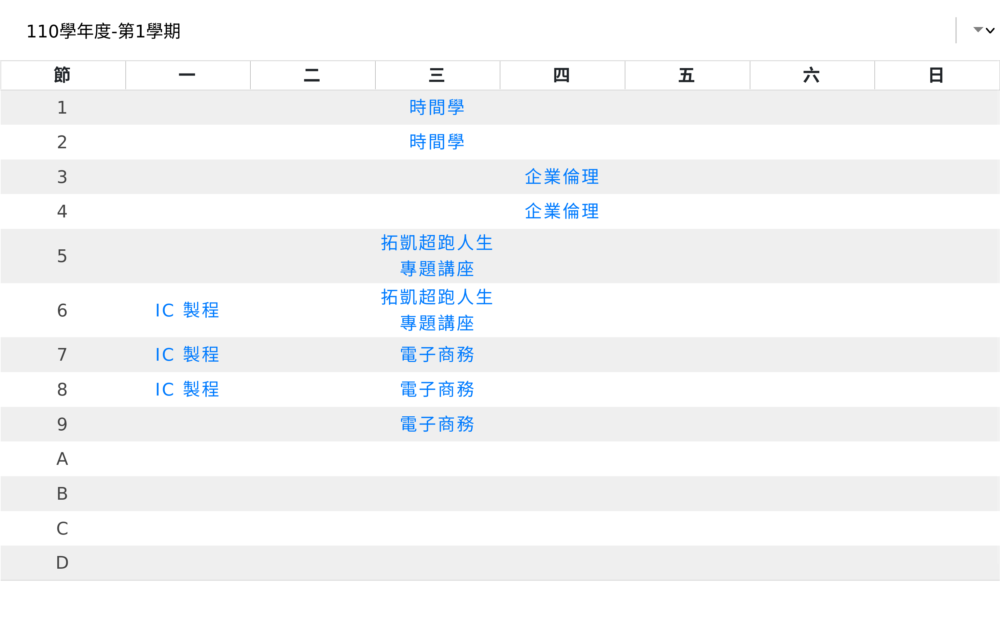

#  以學號取得北科大課表(電腦板說明)
- [Firefox Android 說明](FA.md)
- [其他行動裝置瀏覽器說明](ETC.md)
## 安裝 Tampermonkey (或使用支援 User Script 的瀏覽器)
#### download for Firefox, LibreWolf

#### download for Chrome, Brave, Edge

## 安裝腳本

## 使用說明
### 將 User Agent 設為 Android
我推薦使用 User Agent Switcher and Manager

#### download for Firefox, LibreWolf

#### download for Chrome, Brave, Edge

### 如果有用 delete-security-code 這個腳本，需要將其關閉，否則可能無法正常登入系統

### 登入校園入口

### 選擇左上角選單

### 選擇應用系統

### 選擇 App 應用程式

### 選擇課表查詢系統

### 輸入要查詢的學號

### 選擇學期

### 完成

